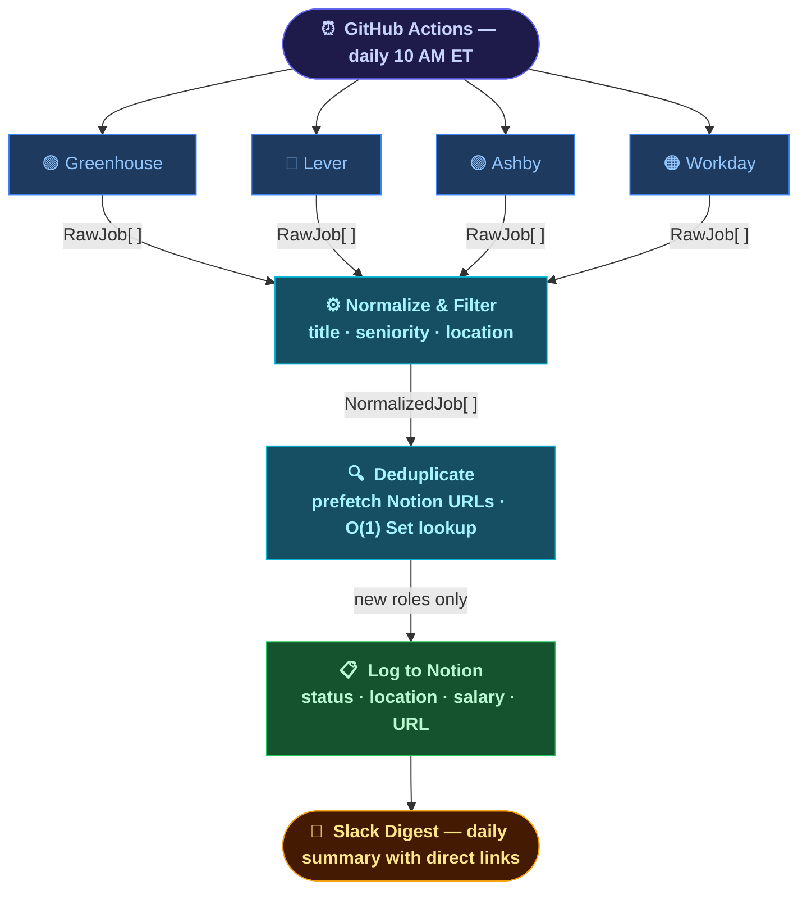

<div align="center">
  
  <h1>job-search-automation</h1>
  <p>A pipeline that monitors ATS job boards daily, filters roles against a target profile, deduplicates against a Notion tracker, and surfaces new opportunities to Slack automatically.</p>
</div>

<div align="center">

[](https://www.typescriptlang.org/)
[](https://nodejs.org/)
[](https://developers.notion.com/)
[](https://docs.github.com/en/actions)

</div>

---

## Overview

Manual job searching at scale is repetitive and inconsistent. This pipeline eliminates the mechanical parts:

- **Fetches** job listings daily from configured companies via Greenhouse, Lever, Ashby, and Workday ATS public APIs
- **Filters** by title keywords, seniority, and US-only/remote location before anything is written anywhere
- **Deduplicates** against an existing Notion Job Tracker — roles already logged are skipped
- **Logs** new roles directly to Notion with status set to `Researching` for manual review
- **Notifies** via Slack with a daily digest linking directly to each posting

The result: wake up each morning to a curated list of new roles in Notion, ready to review.

---

## Pipeline Architecture

<div align="center">



</div>

---

## Getting Started

### 1. Clone and install

```bash
git clone https://github.com/your-username/job-search-automation.git
cd job-search-automation
npm install
```

### 2. Create a Notion integration

1. Go to [notion.so/my-integrations](https://www.notion.so/my-integrations) and create a new integration
2. Copy the **Internal Integration Token** — this is your `NOTION_TOKEN`
3. Open your Job Tracker database in Notion, click **···** → **Connect to** → select your integration
4. Copy the database ID from the URL: `notion.so/<workspace>/**<database-id>**?v=...`

### 3. Set up a Slack webhook

1. Go to [api.slack.com/apps](https://api.slack.com/apps) → **Create New App** → **From scratch**
2. Under **Incoming Webhooks**, activate and add a new webhook to your target channel
3. Copy the webhook URL — this is your `SLACK_WEBHOOK_URL`

### 4. Configure environment variables

```bash
cp .env.example .env
```

| Variable             | Required | Description                             |
| -------------------- | -------- | --------------------------------------- |
| `NOTION_TOKEN`       | ✅       | Notion integration token                |
| `NOTION_DATABASE_ID` | ✅       | Job Tracker database ID                 |
| `SLACK_WEBHOOK_URL`  | ✅       | Slack incoming webhook for daily digest |

### 5. Add your target companies

Companies live in `src/config/companies/` split by market segment. Each entry follows this shape:

```json
{ "name": "Acme", "ats": "greenhouse", "slug": "acme", "enabled": true }
```

Set `"enabled": false` to pause a company without removing it. Supported ATS platforms:

| Platform   | `slug` format                                                                           |
| ---------- | --------------------------------------------------------------------------------------- |
| Greenhouse | Board slug — e.g. `acme`                                                                |
| Lever      | Board slug — e.g. `acme`                                                                |
| Ashby      | Board slug — e.g. `acme`                                                                |
| Workday    | `<subdomain>.<pod>/<cxs-company>/<cxs-site>` — e.g. `acme.wd5/acme/search` |

### 6. Run the pipeline

```bash
# Run locally
npm run dev

# Type-check
npm run typecheck

# Lint
npm run lint

# Tests
npm test
```

### 7. Deploy via GitHub Actions

Add `NOTION_TOKEN`, `NOTION_DATABASE_ID`, and `SLACK_WEBHOOK_URL` as repository secrets under **Settings → Secrets and variables → Actions**. The pipeline runs automatically every day at 10 AM ET and can be triggered manually from the **Actions** tab.

---
